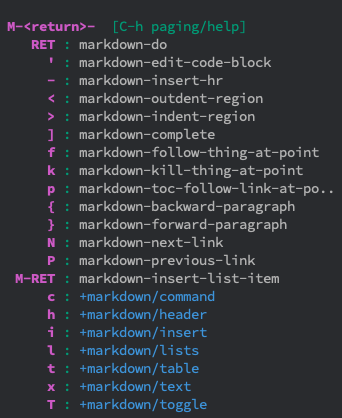

# Todo list for website:

## Things to do:

  * [ ] Get markdown live preview working in emacs
      * [x] Update Macports
      * [x] Install pandoc
      * [ ] Install/enable markdown, GFMD, Kramdown in pandoc
      * [x] Get pandoc hooked into emacs
  * [x] Add website link to README
  * [ ] Look into modifying theme to fix checkbox rendering
  * [x] Make Git Notes Page
  * [ ] remove H7 from front page.
  * [ ] fix stupid trailing space red bars in emacts >_>
    * [ ] Make that urgent


## Pages to make:

  * [x] Todo List
  * [ ] Syntax examples for Markdown
  * [ ] GitUp Notes
  * [ ] Syntax examples for Github Flavored Markdown
  * [ ] Syntax examples for Kramdown
  * [ ] AI-Jail (in top bar) (maybe)
  * [ ] HTML-Only (in top bar)

### Todo export:
* Look into cron jobs for stuff like running macports update that has to compile/install but i'll never do unless I'm doing something using macports already.


```java
public class Runner {
    public static void main(String[] args) {
        System.out.println("Hello, World!");
    }
}
```


## Notes

`,` and `M-RET` and `SPC m` all act as the entry command for the major mode command tree. Notably, only M-RET works in `--INSERT MODE--`.

### Emacs Markdown Editing


#### All Modes

##### `M-RET | SPC m | ,` Shortcut Tree
* `RET` Makes new checkbox out of the current line (modes: normal, insert)

* `M-RET` makes a new item in a list in insert mode (if cursor at end of line, makes one before, if at start, makes one after. if in middle, slices line into 2 entries.
    * Note: only works at EOL if in `--INSERT MODE--`
* `l i` does the same thing
* `c r` makes a preview window of the formatted markdown.


##### Normal Mode


##### Insert Mode

Markdown M-ret shortcuts


